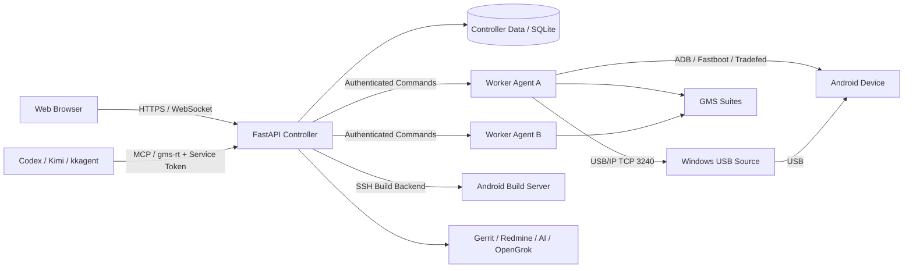
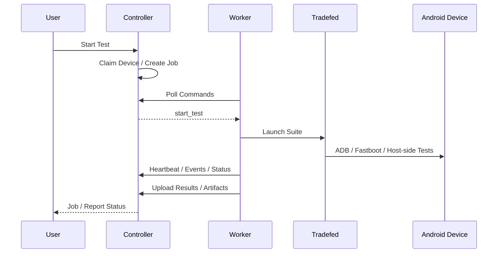

# GMS Remote Test Web

面向 Android GMS 认证测试场景的远程测试与设备调度平台。

项目以 FastAPI Controller 为控制中心，通过 Worker Agent、USB/IP、ADB/Fastboot、noVNC、SSH 等能力，将分散在不同主机上的 Android 设备、GMS 测试套件、固件、构建服务器和测试结果统一到 Web 平台中管理。

当前主要面向 CTS / GTS / VTS / STS 等 Android 兼容性与 GMS 认证测试工作流，同时集成设备共享、测试调度、固件烧录、报告分析、构建任务、自动化、Gerrit / Redmine、知识库和 AI Assistant 等能力。

项目同时提供可独立安装的 **GMS Agent Runtime / MCP Plugin**，用于让 Codex、Kimi、kkagent 等 Agent 在其他 Linux/编译服务器上通过受控 CLI/MCP 接口访问平台能力。Agent 使用独立的 Service Token，不需要接触 Web 登录密码；破坏性操作继续由服务端权限、一次性 Approval Token、设备/Worker ACL 和审计链约束。

> 本项目属于测试基础设施工具。生产环境部署前请完整阅读本文的“生产部署”和“安全模型”章节，尤其不要将真实密码、Token、API Key、Partner Key 或其他凭据提交到 Git 仓库。

---

## 目录

- [核心能力](#核心能力)
- [系统架构](#系统架构)
- [为什么使用 USBIP](#为什么使用-usbip)
- [项目结构](#项目结构)
- [运行环境](#运行环境)
- [快速开始](#快速开始)
- [生产部署](#生产部署)
- [Controller 配置](#controller-配置)
- [Agent Runtime 与 MCP](#agent-runtime-与-mcp)
- [Worker Agent](#worker-agent)
- [Windows USBIP 来源主机](#windows-usbip-来源主机)
- [GMS 测试执行](#gms-测试执行)
- [固件与 GSI](#固件与-gsi)
- [构建服务器](#构建服务器)
- [远程桌面与终端](#远程桌面与终端)
- [Assistant 与外部集成](#assistant-与外部集成)
- [安全模型](#安全模型)
- [CI 与测试](#ci-与测试)
- [发布打包](#发布打包)
- [常见问题](#常见问题)
- [开发约定](#开发约定)

---

## 核心能力

### GMS / Android 测试

- CTS / GTS / VTS / STS 测试套件统一管理
- 单设备测试与多设备执行
- Module / Test Case 级运行
- 测试任务启动、停止、重试和状态跟踪
- Worker 侧 Tradefed 任务发现与运行状态回传
- 测试结果、报告和 Artifact 汇总
- 测试报告分析与问题定位辅助

### Android 设备管理

- ADB / Fastboot / Recovery 状态识别
- USB/IP 跨主机设备共享
- Windows `usbipd-win` 来源主机支持
- Worker USB/IP attach / detach 与异常恢复
- USB/IP assignment 状态跟踪
- 设备连接、重连和协议可用性检查
- ADB Proxy 能力
- 多 Worker 设备清单与状态同步

### 集群与 Worker

- Controller + Worker Agent 架构
- Worker 注册、Heartbeat、Session 和 Generation 管理
- Worker Token 认证
- Job / Command 调度
- Worker 丢失检测与任务回收
- Device Claim / Lease
- Worker 测试套件同步
- Job Artifact 上传与状态同步
- 跨用户只读任务监控

### 固件与测试套件

- Firmware / GSI 烧录工作流
- 固件共享与下载
- 测试套件扫描、导入、解压和分发
- Worker 测试套件库存同步
- 固件烧录后的设备在线检查

### 构建服务器

- SSH 构建服务器接入
- 受控 Build Template
- 参数 Schema、Choices、Pattern 校验
- Tmux 后台构建
- 构建日志跟踪
- 超时和取消
- 构建产物自动发现

### Web 运维能力

- noVNC 远程桌面
- Web Terminal / SSH
- 用户与权限管理
- Security Audit
- Health / Metrics
- API 文档与系统信息
- 通知中心

### 工程与辅助能力

- GMS Assistant
- AI Provider 路由
- Codex / Kimi / kkagent 的 MCP Agent Runtime
- Agent Service Token、一次性 Enrollment / Approval Token
- Gerrit Dashboard
- Redmine Dashboard / Agent / Evidence Snapshot
- Knowledge Base
- OpenGrok / Code Search 集成，并可按 Android 版本选择源码工程
- APK 分析、JADX 源码搜索与读取
- Commit-pinned SDK Source Search / Read
- Automation / Gerrit Webhook
- Android UI 操控、Logcat 与设备截图相关能力

---

## 系统架构



整个系统可以分为四个主要角色：

1. **Controller**：负责 Web UI、认证、权限、任务调度、配置、报告、集群状态和外部系统集成。
2. **Worker Agent**：运行在实际执行 GMS 测试的 Linux 主机上，负责 ADB、Fastboot、Tradefed、USB/IP、固件烧录和本地资源探测。
3. **Device Source**：Android 设备实际 USB 所在主机。直接 USB/IP 来源工作流当前主要支持 Windows + `usbipd-win`。
4. **Agent Runtime**：运行在 Codex / Kimi / kkagent 所在主机，通过 `gms-rt` CLI 和 MCP Adapter 调用 Controller；不直接持有平台用户密码，也不绕过 Controller 的权限、审批和审计边界。

Worker 与 Controller 之间通过带 Token 的 HTTP(S) API 进行注册、Heartbeat、命令轮询和 ACK；Agent 使用单独的 Agent Service Token。生产环境要求 Worker 与 Agent 均通过受信任的 HTTPS Controller URL 访问平台。

---

## Android 设备远程接入方案对比

GMS 自动化测试不只执行 `adb shell`。测试过程中设备可能进入 Recovery、
Bootloader Fastboot、Fastbootd 或 RockUSB Loader；固件/GSI 烧写还要求测试
主机能够持续访问同一个物理 USB 设备。因此“远程能够看到 ADB”不等于覆盖
完整的 GMS 测试和烧写链路。

平台支持四种远程接入方案，按适用场景递进：

### 方案一：网络 ADB（`adb tcpip`）

```text
Android Device (adbd TCP:5555)
    │ TCP/IP
    ▼
Linux Worker (adb connect <ip>:5555)
```

- 设备端 `adbd` 切换到 TCP 模式，Worker 通过 `adb connect` 直接访问。
- **限制**：依赖设备端 `adbd` 进程和网络栈；设备重启、进入 Fastboot/Loader
  后 TCP 端口消失，ADB 链路中断且无法自动恢复。不支持 Fastboot、Recovery、
  RockUSB Loader 及固件烧写。
- **适用**：临时调试、不涉及 USB 模式切换的简单 `adb shell` 场景。

### 方案二：SSH ADB 端口转发

```text
Android Device (USB)
    │ USB
Source Host (adb server :5037)
    │ SSH Tunnel (-L 5037:localhost:5037)
    ▼
Linux Worker (ADB over forwarded 5037)
```

- 通过 SSH 隧道转发来源主机的 ADB Server 端口（通常 5037），Worker 侧
  `adb` 命令经隧道到达来源端 ADB Server。
- **限制**：来源端 ADB Server 是单点；5037 端口被独占时多设备互斥。设备
  离开 ADB 模式后链路中断，来源端 ADB Server 必须仍能看到设备才能恢复。
  不支持 Fastboot、Loader 和固件烧写。
- **适用**：兼容旧部署、无需 Fastboot 的远程 ADB 调试。

### 方案三：ADB Proxy（`adbproxy-rs`）

```text
Android Device (USB)
    │ USB
Source Host (adbproxy-rs agent)
    │ gRPC / TCP
    ▼
Linux Worker (adb client → adbproxy → device)
```

- 按设备粒度代理 ADB Server 协议，支持设备级选择、授权和租约，比端口转发
  更灵活。ADB Proxy 来源 Agent 当前仅发布 Linux x86_64 版本。
- **限制**：代理的是 ADB 协议层，设备离开 ADB 模式（Fastboot/Loader）后
  代理链路中断。不支持 Fastboot、Loader 和固件烧写。
- **适用**：ADB-only 测试场景和跨 Linux Worker 的设备共享。

### 方案四：USB/IP（推荐，全链路）

```text
Android Device (USB)
    │ USB
Source Host (usbipd-win / linux usbip)
    │ USB/IP TCP 3240
    ▼
Linux Worker (vhci_hcd → 本地 USB 设备)
    ├── adb server
    ├── fastboot
    ├── upgrade_tool (RockUSB Loader)
    └── Tradefed / CTS / GTS / VTS / STS
```

- 在 USB 协议层转发整个物理设备，Worker 侧看到的是完整的本地 USB 设备。
  设备在 ADB / Fastboot / Fastbootd / Recovery / RockUSB Loader 之间切换时，
  平台按来源主机和 BUSID 自动重新 bind/attach，保持测试主机对同一物理设备
  的持续访问。
- **适用**：GMS 全链路测试、固件/GSI 烧写、Bootloader OEM 锁定/解锁、
  企业设备池化管理。

### 对比总结

| 对比维度 | 网络 ADB (`adb tcpip`) | SSH ADB 端口转发 | ADB Proxy (`adbproxy-rs`) | USB/IP |
|---|---|---|---|---|
| 转发层级 | 设备 `adbd` TCP 端口 | ADB Server（通常 5037） | 按设备代理 ADB Server 协议 | USB 协议/物理设备 |
| ADB 操作 | 支持 | 支持 | 支持 | 支持 |
| CTS/GTS/VTS/STS | 仅适合不切换 USB 模式的用例 | 部分支持，受单一 ADB Server 和端口约束 | 支持 ADB/测试场景及平台设备租约 | 完整支持，推荐 |
| Recovery | 网络重置后通常失联 | 仅在来源 ADB Server 仍可见时可用 | 仅支持仍提供 ADB 的 Recovery | 支持 |
| Bootloader Fastboot / Fastbootd | 不支持 | 不支持 | 不支持 | 支持 |
| RockUSB Loader / MaskROM | 不支持 | 不支持 | 不支持 | 支持 |
| 系统重启及 USB 重新枚举 | 弱，依赖网络和 `adbd` | 有限 | 有限，ADB 消失后代理链路中断 | 支持，平台按来源与 BUSID 自动重连 |
| 固件/GSI 烧写 | 不支持 | 不支持 | 不支持 | 支持 |
| Bootloader OEM 锁定/解锁 | 不支持 | 不支持 | 不支持 | 支持 |
| 多设备/多 Worker | 弱，需自行管理端口 | 受 5037 单端口模型约束 | 强，支持设备级选择、授权和租约 | 强，支持 BUSID 分配和物理设备池化 |
| 推荐用途 | 临时调试 | 兼容旧部署 | ADB-only 测试和跨 Linux Worker 共享 | GMS 全链路、烧写和企业设备池 |

### 选型结论

- 只需要 ADB 命令或不发生模式切换的测试，可使用 ADB Proxy。当前
  ADB Proxy 来源 Agent 仅发布 Linux x86_64 版本；Windows 设备来源应使用
  USB/IP。
- 需要 Fastboot、Fastbootd、Recovery、RockUSB Loader、固件/GSI 烧写或
  Bootloader OEM 锁定时，必须使用本地 USB 或 USB/IP，不能回退到网络 ADB、
  5037 端口转发或 ADB Proxy。
- 平台设备占用/任务租约与传输协议独立，ADB Proxy 和 USB/IP 都会受到租约
  保护；页面中的“锁定设备/解锁设备”指 Bootloader OEM 锁定，只有完整 USB
  通道支持。
- `usbipd-win` 的 attach 不是持久连接；设备重启或切换 USB 身份后需要重新
  attach。平台会保存来源 BUSID，并在 ADB/Fastboot/Fastbootd/Loader 切换时
  自动 bind/attach。参见 [usbipd-win 连接说明](https://github.com/dorssel/usbipd-win#connecting-devices)。

Rockchip Loader 的 PID 会随 SoC 改变，VID 固定为 `2207`。例如当前 RK3572
Loader 枚举为 `2207:351a / Rockusb Device`。部署可在 `configs/config.json`
配置需要显式识别的身份：

```json
{
  "usbip_vid_pids": [
    "2207:0006",
    "18d1:4d00",
    "2207:351a"
  ]
}
```

平台还会识别 `Rockusb Device` 标记，并在烧写模式切换时优先重挂载原 BUSID，
降低新增 SoC/PID 导致重连失败的风险。RockUSB 模式和不同 SoC 使用不同 PID
的说明见 [Rockchip Rockusb 文档](https://opensource.rock-chips.com/wiki_Rockusb)。

### 固件烧写（Rockchip update.img）

平台的完整固件烧写只使用 Rockchip `upgrade_tool uf` 整包路径。当前 API 的
`burn_mode` 仅接受 `auto` 与 `uf`；历史上的 USB/IP Fastboot 分区烧写、
`partition`（同会话 DI）、`transport-probe-force` 等实验性 backend 已删除，
不再属于当前架构。

**Local USB devices**（直连 Ubuntu 测试主机）：平台确认设备处于 ADB、
Fastboot 或 Rockusb Loader 可识别状态后，由测试主机执行
`upgrade_tool uf` 完成 update.img 烧写。Fastboot 状态的设备先回到
Android/ADB 再进入 Loader；已处于 Rockusb Loader 的设备直接进入烧写。

**USB/IP devices**：完整固件烧写必须在设备的物理 Source Host 上执行，
不跨 USB/IP 链路维持 ADB → Loader → MaskROM 多次 USB 重枚举。流程：

1. 平台解析设备到 (Source Host, BUSID) 的持久物理路由，并确认
   usbipd-win AutoBind 策略（Windows 来源，4.2+）或用户态 usbipd 导出
   进程（Ubuntu 来源）。
2. 烧写前显式完成所有权交还：暂停目标设备的通用重连 watchdog，目标
   Worker 侧 vhci detach，并 fail-closed 复核端口已释放——只有确认
   Source Host 物理持有设备后才开始烧写。
3. **Windows Source**：由运行在交互桌面会话中的 Windows Source Agent 调度
   RKDevTool 完成（Controller SFTP 上传固件与任务文件，轮询结果）。
4. **Ubuntu/Linux Source**：支持设备共享、分配与重连；在 Linux Source
   完整烧写 backend 实现之前，API 拒绝（HTTP 409）对 Linux 来源 USB/IP
   设备的完整固件烧写，不会误送入 Windows backend。
5. 烧写完成或失败后，平台按原物理路由恢复 USB/IP 导出与 Worker attach。

Loader、MaskROM 等 USB 重枚举属于 Source 端烧写 backend 的内部细节，
不需要（也无法）由用户手工选择传输 backend。

**Safety**：固件烧写属于破坏性操作。Agent 调用必须使用 Agent Service
Token，并提供与目标设备集合、固件 SHA-256、`wipe_data`、`burn_mode`
精确绑定的一次性 approval token；令牌只能消费一次，不能跨固件、设备或
参数复用。

Windows 来源主机需要 usbipd-win 4.2+，SSH 账号必须具有执行策略命令的
管理员权限。需要手工排查时，可在管理员 PowerShell 中执行：

```powershell
usbipd --version
usbipd policy list
usbipd policy add --effect allow --operation AutoBind --busid 1-1
```

策略只应授予平台已分配的专用 Android USB 端口；不要为键盘、摄像头或整类
不受控 USB 设备创建宽泛规则。策略命令及其从 4.2.0 开始提供的说明参见
[usbipd-win AutoBind policies](https://github.com/dorssel/usbipd-win/wiki/New-design%3A-policies)。

---

## 为什么使用 USB/IP

GMS 认证测试并不只是简单执行 `adb shell`。CTS / GTS / VTS / STS 的 Host Side 测试、Tradefed 子进程以及 Fastboot / Recovery 等场景通常要求测试主机能够看到完整的本地 USB 设备。

因此本项目优先采用：

```text
Android Device
    │ USB
    ▼
Device Source Host
    │ USB/IP
    ▼
Linux Worker
    │
    ├── adb server
    ├── fastboot
    └── Tradefed / CTS / GTS / VTS / STS
```

而不是将设备切换为：

```text
adb tcpip 5555
```

这样可以尽量保持测试主机侧的 USB 语义，并兼容需要本地 ADB Server、Fastboot 或 USB 枚举的测试流程。

项目已经包含 USB/IP 的：

- 来源设备发现
- BUSID 选择
- Windows bind
- Linux attach / detach
- `vhci_hcd` 检查
- ADB / Fastboot / Recovery 探测
- Assignment 状态跟踪
- Worker 重启后的恢复与 reconciliation
- 网络可达性检查
- 错误分类与清理流程

---

## 项目结构

```text
GMS_Remote_Test_Web/
├── app.py                    # FastAPI 入口
├── bootstrap/                # 应用装配、生命周期、路由、安全启动检查
├── foundation/               # 公共基础设施与跨 Feature Port
├── features/                 # 业务 Feature
│   ├── assistant/
│   ├── auth/
│   ├── automation/
│   ├── build/
│   ├── cluster/
│   ├── devices/
│   ├── email/
│   ├── firmware/
│   ├── gerrit/
│   ├── knowledge/
│   ├── redmine/
│   ├── reports/
│   ├── system/
│   └── test_execution/
├── agent/gms-remote-test/    # Agent Runtime 唯一手工维护源码树
├── plugins/gms-remote-test/  # 由 tools/sync_agent_package.py 生成的插件树
├── plugins/codesearch/       # Code Search 插件
├── worker_agent/             # Worker Agent
├── web/                      # Web 静态资源与页面逻辑
├── workflows/                # 业务工作流
├── configs/                  # 示例配置与本地部署配置
├── scripts/                  # 安装、校验、维护脚本
├── tools/                    # Host Tools / native helper / Agent 打包工具等
├── tests/                    # 单元、架构、前端、Soak 等测试
├── .github/workflows/        # CI / Nightly Soak
├── install.sh                # 安装和发布包生成
├── requirements.txt
└── pyproject.toml
```

代码组织遵循一个基本原则：

```text
Feature
  ↓
Foundation / Port
  ↓
Infrastructure
```

跨 Feature 依赖尽量通过公开包边界或 Foundation Port 连接，避免重新形成大型单体模块和循环依赖。

Agent 包另有明确的单一源码规则：`agent/gms-remote-test/` 是唯一允许手工修改的 Agent Package Source Root；`plugins/gms-remote-test/` 是生成结果，不应直接修改。

---

## 运行环境

### Controller / Worker 推荐环境

- Ubuntu / Debian 系 Linux
- Python 3.10+
- systemd
- OpenSSH Client / Server
- ADB / Fastboot
- USB/IP tools
- Java Runtime（运行 Tradefed / CTS / GTS 等）
- noVNC / websockify / x11vnc（需要远程桌面时）

`install.sh` 会在支持 `apt-get` 的系统上自动安装主要依赖，并尝试安装：

```text
python3
python3-venv
python3-pip
rsync
curl
lsof
psmisc
openssl
openssh-client
openssh-server
sudo
iproute2
x11vnc
novnc
websockify
libudev1
```

同时会尝试安装可选组件：

```text
usbip
adb
fastboot
android-tools-adb
android-tools-fastboot
default-jre
```

### Windows Device Source

推荐：

- Windows 10 / Windows 11
- OpenSSH Server
- `usbipd-win`
- Android USB Driver / ADB Interface
- TCP 22 可被 Controller / Worker 访问
- TCP 3240 可被 USB/IP Worker 访问

### Agent Client

远端 Codex / Kimi / kkagent 主机不要求 Clone 整个项目。安装后的 Agent Package 自包含 `gms-rt` CLI、MCP Server、SDK、Skill 和对应 Client Manifest。基础依赖为 Linux、Python 3 和 `curl` 或 `wget`；若 Controller 使用私有 CA，还需要准备受信任的 CA Certificate。

### 网络

项目可工作于：

- 公司 LAN
- VPN
- Tailscale 等受控组网环境

生产环境不要通过未经审核的远程脚本安装网络软件；`install.sh` 只会启用已经存在的 Tailscale，不会执行 `curl | bash` 类安装方式。

---

## 快速开始

### 1. Clone

```bash
git clone https://github.com/weixin1263831586/GMS_Remote_Test_Web.git
cd GMS_Remote_Test_Web
```

### 2. 创建 Python 环境

```bash
python3 -m venv .venv
source .venv/bin/activate
python -m pip install --upgrade pip
pip install -r requirements.txt
```

### 3. 开发模式运行

项目没有真实 `configs/config.json` 时会使用示例配置作为结构参考，但涉及 SSH、设备、Redmine、Gerrit、AI 等能力前仍需要准备本地部署配置。

最小开发启动可使用：

```bash
GMS_ENV=development python app.py
```

默认服务端口由项目 Settings 决定；标准安装流程默认使用 `5001`。

> 不建议为了开发测试直接把 `configs/runtime.example.json` 原样复制成 `runtime.json`。该模板默认声明 `GMS_ENV=production`，而 production 模式要求完整的认证、HTTPS 和安全密钥配置。

---

## 生产部署

推荐使用项目自带安装器，而不是手工启动 Uvicorn。

### 一键安装

```bash
./install.sh
```

默认值：

```text
安装目录: /opt/gms-remote-test/web_app
systemd 服务: gms-web-app
HTTPS 端口: 5001
```

也可以指定：

```bash
./install.sh \
  --install-dir /opt/gms-remote-test/web_app \
  --service-name gms-web-app \
  --port 5001 \
  --user "$USER"
```

安装器会负责：

- 安装系统依赖
- 创建 Python venv
- 安装 Python requirements
- 创建运行目录
- 创建 HTTPS 证书
- 创建 Secret Key
- 创建 Audit HMAC Key
- 创建 Metrics Token
- 创建 Automation Webhook Token
- 创建 Bootstrap Token
- 创建 Skill Signing Key
- 创建本地 Worker Token
- 写入 `configs/runtime.json`
- 写入本地 Worker 配置
- 设置私密文件权限
- 安装并管理 systemd 服务
- 配置 noVNC / Worker 所需运行环境

生产安装完成后，应使用 HTTPS 访问 Controller。

### 运行入口

源码入口为：

```bash
python app.py
```

内部由 Uvicorn 启动 FastAPI：

```text
host               = settings.server_host
port               = settings.server_port
keep-alive         = 120s
limit_concurrency  = 500
limit_max_requests = 10000
```

生产环境默认关闭 Uvicorn access log，并在应用启动阶段执行 fail-closed 安全配置检查。

---

## Controller 配置

### 主配置

示例：

```text
configs/config.example.json
```

本地部署时复制为：

```bash
cp configs/config.example.json configs/config.json
```

然后只在本机填写真实配置。

主要配置包括：

```text
Ubuntu 测试主机
Firmware Share
SSH
USB/IP VID:PID
Wi-Fi
VNC
VPN
GMS Suite 路径
测试脚本
GSI 脚本
scrcpy
OpenGrok
Redmine
Gerrit
AI Provider
Sidebar
External Services
```

Secret 推荐使用：

```text
${ENV_NAME:}
```

占位符或运行环境变量，不要把真实密码直接写进可提交配置。

### Runtime 配置

模板：

```text
configs/runtime.example.json
```

生产安装器会生成真实：

```text
configs/runtime.json
```

该文件包含运行环境和敏感配置，例如：

```text
GMS_ENV
GMS_AUTH_REQUIRED
GMS_SECURE_COOKIES
GMS_SECRET_KEY_FILE
GMS_AUDIT_HMAC_KEY_FILE
GMS_METRICS_TOKEN
GMS_AUTOMATION_WEBHOOK_TOKEN
GMS_BOOTSTRAP_TOKEN
GMS_SKILL_SIGNING_KEY_FILE
```

`bootstrap.env_loader` 会在应用模块导入前加载 `runtime.json`，但真实系统环境变量优先级更高。

生产环境至少应确保：

```text
GMS_ENV=production
GMS_AUTH_REQUIRED=true
GMS_SECURE_COOKIES=true
```

并配置：

```text
TRUSTED_HOSTS
GMS_ALLOWED_ORIGINS
Worker Tokens
Metrics Token
Automation Webhook Token
Bootstrap Token
```

敏感文件建议权限：

```bash
chmod 600 configs/runtime.json
chmod 600 configs/worker_tokens.json
```

---

## Agent Runtime 与 MCP

`agent/gms-remote-test/` 是面向 Codex、Kimi、kkagent 和其他 MCP Client 的统一 Agent Package Source Root。当前版本以 `agent/gms-remote-test/package.yaml` 为唯一版本源；不要在多个 manifest、CLI 或生成目录中分别手工维护版本号。

Agent Package 包含：

```text
gms-rt CLI
MCP Server / Launcher
gms-agent 安装与升级 CLI
Python SDK
SKILL.md / references / agent metadata
Codex / Kimi / kkagent manifests
Package tests
```

### 一键安装与 Enrollment

Controller 暴露安装入口：

```text
/api/agent/install.sh
```

先由已登录用户在 Web 端生成一次性 Enrollment Code，再在 Agent 主机执行安装。生产环境推荐显式信任 Controller CA，例如：

```bash
export GMS_INSTALL_CA_CERT=/path/to/controller-ca.crt
curl -fsSL --cacert "$GMS_INSTALL_CA_CERT" \
  https://CONTROLLER:5001/api/agent/install.sh | bash -s -- <ENROLLMENT_CODE>
```

受控实验环境若使用自签名证书，可以按部署策略使用 installer 支持的 insecure bootstrap；不要在公网或不可信网络中关闭 TLS 校验。

安装完成后，Agent 通过 `GMS_AUTH_TOKEN_FILE` 指向权限为 `0600` 的 Service Token 文件。Agent 不需要、也不应接收平台用户密码。

常用维护入口：

```bash
gms-agent update
gms-agent rollback
gms-rt-system-selfcheck --json
```

### Agent 能力范围

当前 Agent Runtime 覆盖：

```text
设备清单与状态
CTS / GTS / VTS / STS 测试启动与 Durable Job 查询
报告与 Artifact
Redmine Evidence Snapshot / Journal / Attachment
APK 导入、JADX Source Search / Read
SDK Source Provider / commit-pinned Search / Read
ADB Shell 只读能力、Logcat、Screencap
固件烧录与其他受审批操作
```

通用 `gms_rt_run` 只允许执行 CLI 标记为 `agent_safe_unattended` 的命令。高风险或修改性操作必须通过专用 typed tool、服务端授权和必要的一次性 Approval Token，不允许依靠客户端传入一个 `authorized=true` 之类的布尔值作为安全边界。

### 包完整性与更新链

生产环境应配置：

```text
GMS_SKILL_SIGNING_KEY_FILE
```

Controller 生成 Agent Package Manifest 时会绑定包名、版本、SHA-256 和大小，并使用 Ed25519 签名。Bootstrap 会把对应 Verify Key 固定到安装后的 `gms-agent`；后续下载要求同源 URL、禁止重定向，并验证 SHA-256、Ed25519 签名和安全解包约束。

开发 Agent Package 时只修改：

```text
agent/gms-remote-test/
```

然后同步生成插件：

```bash
python tools/sync_agent_package.py
```

版本发布使用：

```bash
python tools/release_agent.py --version X.Y.Z
```

构建分发包使用：

```bash
python tools/build_agent_package.py
```

`plugins/gms-remote-test/` 是生成结果，CI 的 Agent Package Gate 会校验生成树、版本契约和打包结果是否与源码树同步。

---

## Worker Agent

Worker Agent 是实际执行测试任务的节点。

典型职责：

```text
设备探测
ADB / Fastboot
Tradefed
CTS / GTS / VTS / STS
USB/IP Client
Firmware / GSI
Suite Scan
Artifact
Host Metrics
ADB Proxy
noVNC Capability
```

Worker 启动时会向 Controller 注册，Controller 返回：

```text
session_id
connection_generation
heartbeat_interval
```

之后 Worker 周期性执行：

```text
Heartbeat
→ 上报主机资源
→ 上报 Android 设备
→ 上报运行中的测试
→ 上报命令状态
→ 上报 Suite Inventory
→ 获取撤销的 Device Claim
```

### Worker 配置

默认配置路径：

```text
~/.config/gms-worker/config.json
```

也可以通过：

```bash
export GMS_WORKER_CONFIG=/path/to/config.json
```

指定。

最小配置结构：

```json
{
  "worker_id": "ats-worker-01",
  "name": "ATS Worker 01",
  "controller_url": "https://controller.example.com:5001",
  "worker_token_file": "/home/operator/.config/gms-worker/token",
  "heartbeat_interval_seconds": 15,
  "suite_scan_interval_seconds": 300,
  "max_jobs": 2,
  "suite_roots": [
    "/home/operator/GMS-Suite",
    "/opt/GMS-Suite"
  ],
  "data_root": "/home/operator/gms-worker-data"
}
```

也支持环境变量覆盖：

```bash
export GMS_WORKER_ID=ats-worker-01
export GMS_CONTROLLER_URL=https://controller.example.com:5001
export GMS_WORKER_TOKEN='...'
export GMS_WORKER_ADDRESS=192.0.2.20
export GMS_WORKER_SSH_USER=operator
export GMS_CONTROLLER_CA=/path/to/controller-ca.crt
```

生产环境：

```text
GMS_ENV=production
```

时 Worker 强制要求 HTTPS Controller URL。

### Worker Token

Token 可以从：

```text
GMS_WORKER_TOKEN
```

或：

```text
worker_token_file
```

读取。

如果使用 Token 文件，权限必须为：

```bash
chmod 600 /path/to/token
```

否则 Worker 会拒绝启动。

### Source-only Worker

Worker 支持：

```json
{
  "source_only": true
}
```

用于只承担设备来源或传输角色、而不执行 CTS / GTS / VTS / STS 的节点。

---

## Windows USBIP 来源主机

直接 USB/IP 来源模式当前主要面向 Windows。

### 1. 安装 usbipd-win

在管理员 PowerShell 中：

```powershell
winget install dorssel.usbipd-win --source winget
```

验证：

```powershell
usbipd --version
usbipd list
```

### 2. OpenSSH Server

Windows 需要运行 SSH Server，Controller 才能完成来源主机探测、USB 设备发现、ADB 释放和 `usbipd` 操作。

检查：

```powershell
Get-Service sshd
```

确认 TCP 22 可访问。

### 3. USB/IP 网络

Linux Worker 需要能够访问：

```text
Windows_Source_IP:3240
```

检查防火墙、VPN / Tailscale 路由以及中间网络 ACL。

### 4. Linux Worker

确认：

```bash
which usbip
sudo modprobe vhci_hcd
usbip port
```

项目会自动执行 attach / detach 和协议检查，但系统层必须先具备 USB/IP Client 能力。

### 5. ADB 冲突

USB/IP 转发前，Windows 来源端不能继续独占该 Android USB 设备。

常见占用来源：

```text
Android Studio
adb.exe
scrcpy
其他设备管理工具
```

平台会尝试释放 Windows ADB 占用。如果仍然失败，请先关闭这些程序。

---

## GMS 测试执行

Worker 会扫描配置中的 Suite Root，例如：

```text
~/GMS-Suite
/opt/GMS-Suite
```

测试能力包括：

```text
CTS
GTS
VTS
STS
```

典型执行链路：



Controller 与 Worker 不直接信任任意客户端拼出的 Shell `argv`；执行规范在 Controller / Worker 之间共享并由受控代码构造。

测试过程中应尽量保证：

- Worker 上只有需要的 ADB Server
- Android Device 为 `device` 状态
- USB/IP 网络延迟和抖动可接受
- Suite 与 Android 版本匹配
- Java / ADB / Fastboot 版本满足对应测试套件要求

---

## 固件与 GSI

平台包含 Firmware / GSI 相关工作流，包括：

- 固件资源管理
- Firmware Share
- Worker 固件传输
- 烧录任务（Rockchip update.img，`burn_mode=auto|uf`，详见
  [Android 设备远程接入方案对比](#android-设备远程接入方案对比) 的固件烧写一节）
- GSI 烧录
- 烧录后等待设备重新上线
- Fastboot / ADB 状态恢复检查

固件烧录属于破坏性操作，生产环境应配合：

```text
用户权限
设备 Claim
Worker 状态
操作审计
```

使用，避免多个用户同时操作同一物理设备。Agent 发起的烧写还必须携带与
固件 SHA-256 和设备集合绑定的一次性 approval token（见安全模型的
Agent Service Token 一节）。

---

## 构建服务器

配置模板：

```text
configs/build_servers.example.json
```

本地部署时：

```bash
cp configs/build_servers.example.json configs/build_servers.json
```

示例 Server：

```json
{
  "id": "android-build-01",
  "host": "192.0.2.10",
  "port": 22,
  "username": "builder",
  "backend": "ssh",
  "auth": {
    "type": "env_password",
    "env": "BUILD_SERVER_PASSWORD"
  },
  "workspace_root": "/home/builder",
  "max_concurrent_jobs": 1
}
```

密码建议通过环境变量：

```bash
export BUILD_SERVER_PASSWORD='...'
```

而不是写入 Git。

### Build Template

构建命令使用受控模板：

```json
{
  "workspace": "{workspace}",
  "init_commands": [
    "source build/envsetup.sh",
    "lunch {lunch_target}"
  ],
  "command": "{build_command}"
}
```

普通动态参数会进行 Shell Quote。

如果参数必须是完整 Shell 片段，需要显式声明：

```text
trusted_shell_fragment
```

并必须至少配置：

```text
pattern
或
choices
```

建议优先使用 `choices`，例如：

```json
{
  "choices": [
    "./build.sh -UCKApu -J 8",
    "./build.sh -UCKApu -J 16",
    "./build.sh -UCKApu -J 32"
  ]
}
```

Build Template 本质上具有远程代码执行能力，应只允许可信管理员修改。

---

## 远程桌面与终端

Worker 可提供：

```text
Xvfb
x11vnc
websockify
noVNC
```

标准端口：

```text
VNC   5900
noVNC 6080
```

Worker 不仅检查端口是否监听，还会执行 RFB 握手检查，避免将“端口打开但 VNC 实际不可用”误判为正常。

项目也包含 Web Terminal / SSH 相关能力，用于远程维护 Controller、Worker 或客户端主机。

生产环境请限制 SSH 来源地址并使用严格 Host Key 校验。

---

## Assistant 与外部集成

### AI Assistant

AI Provider 在主配置的：

```text
ai_models
```

中配置。

支持按 Provider 配置：

```text
name
enabled
api_key
model
base_url
api_format
temperature
max_tokens
```

API Key 应通过环境变量注入，例如：

```text
GMS_LOCAL_AI_API_KEY
GMS_ZHIPU_API_KEY
GMS_ASSISTANT_API_KEY
```

Assistant 用于测试平台内的辅助分析和工具调用。涉及设备操作、测试执行、构建和其他高权限动作时，仍应以服务端权限控制和受控 Tool Schema 为最终安全边界。

### Gerrit

支持 Gerrit Dashboard、REST / SSH 查询及 Automation 相关能力。

建议：

- 单独创建服务账号
- SSH Key 独立管理
- 最小权限
- 不在仓库中保存 Gerrit Password

### Redmine Evidence

除 Redmine Dashboard / Agent 外，平台支持把 Issue Description、完整 Journal、Attachment Metadata 与可读 Artifact 建立 owner-scoped Evidence Snapshot。Agent 可先刷新快照，再分页读取 Journal、搜索 Artifact 文本、读取图片或把 APK 导入 JADX Pipeline，减少直接反复访问 Redmine 与丢失证据上下文的风险。

### OpenGrok / Code Search / SDK Source

Code Search 已迁移到 `plugins/codesearch/`，诊断工作流可以根据 Android 版本选择对应 OpenGrok Project。

对于不适合通过 OpenGrok 暴露的本地 SDK / Android Source，Controller 还提供管理员配置的只读 SDK Source Provider。搜索结果固定到解析后的 Git Commit，并返回签名 Result ID；后续 Read 继续基于同一 Commit/Blob，避免 Agent 在源码变化后把不同 Revision 的搜索结果拼在一起。

### Knowledge

可将 Android 源码搜索、知识库和测试问题分析连接到统一 Web 工作台。

---

## 安全模型

项目当前包含多层安全控制。

### Web Authentication

Production 模式禁止关闭认证：

```text
GMS_AUTH_REQUIRED=true
```

并要求 Secure Cookie：

```text
GMS_SECURE_COOKIES=true
```

### First-run Bootstrap

首次管理员初始化由：

```text
GMS_BOOTSTRAP_TOKEN
```

保护。

生产环境要求 Token 长度至少 32 字符。

### Worker Authentication

Worker API 使用 Bearer Token，并按 Worker ID 独立管理 Token。

Controller 的 Worker Token 文件默认：

```text
configs/worker_tokens.json
```

也可以通过：

```text
GMS_WORKER_TOKENS_FILE
```

覆盖。

私密 Token 文件应保持 `0600`。

### Agent Service Token

Agent 与人工 Web/CLI Session 分离。Agent 通过一次性 Enrollment Code 换取 Service Token，Token 保存到权限为 `0600` 的本地文件，并按服务端 Scope、Device ACL、Worker ACL 和 owner 边界授权。

不要把 Web 用户名/密码写入 Agent 配置、SKILL.md、MCP Manifest 或环境模板。需要破坏性操作时，应使用用户主动创建、绑定具体工具/设备/操作摘要且短时有效的一次性 Approval Token。

### Agent Package Signing

Production 环境应配置 `GMS_SKILL_SIGNING_KEY_FILE`。未签名的 Agent Manifest / Bootstrap 在生产模式下应 fail closed；客户端安装/升级链必须验证 SHA-256 和 Ed25519 签名，并保持 Artifact URL 与 Controller 同源。

### HTTPS

生产 Worker 强制要求 HTTPS Controller。

标准安装器会为本地部署生成 HTTPS Certificate，并配置 Worker CA。

Agent 主机同样应信任 Controller 的 CA；实际企业环境建议使用组织 CA 或正式 TLS Certificate。

### Trusted Host / Origin

生产环境需要显式配置可信 Host 和 Origin，避免使用通配符。

### CSRF

对于需要 Session 的 Web 请求，应用层包含 CSRF 防护逻辑。

### Security Audit

敏感操作会进入 Security Audit；日志写入前包含 URL / Body / Credential Redaction 处理。

### Secret 管理

不要提交：

```text
configs/runtime.json
configs/worker_tokens.json
真实 config.json 中的密码
SSH Private Key
Gerrit / Redmine Password
AI API Key
Agent Service Token / Enrollment Code / Approval Token
Agent Signing Private Key
GMS / GTS Partner Key
Google Credential JSON
```

推荐：

```text
Environment Variable
0600 Secret File
组织 Secret Manager
```

### SSH Host Key

项目的 SSH 连接逐步统一使用严格 Host Key 校验。生产环境不要通过关闭 Host Key 检查来“解决”首次连接问题。

---

## CI 与测试

GitHub Actions：

```text
.github/workflows/ci.yml
.github/workflows/nightly-soak.yml
```

标准 CI Gate 包含：

```text
Tracked-file Secret Scan
Gitleaks
Ruff
Unit / Feature / Worker Tests
Security Tests
Architecture Tests
Frontend Integrity
Agent Package Gate
Release Tree Validation
Soak Tests
```

本地执行：

```bash
source .venv/bin/activate
ruff check .
pytest tests features worker_agent/tests -q
```

Agent Package 同步与测试：

```bash
python tools/sync_agent_package.py --check
python tools/build_agent_package.py --check
python3 -m pytest plugins/gms-remote-test/tests -q
```

架构测试：

```bash
pytest tests/architecture -q
```

前端完整性：

```bash
pytest tests/test_frontend_integrity.py -q
```

发布树验证：

```bash
pytest tests/test_release_packaging.py -q
```

部分 Soak Test 在没有真实设备或专用实验台环境时会自动跳过；真机链路由 Nightly Soak Runner 执行。

---

## 发布打包

项目支持生成经过完整性校验的离线安装包。

首先配置 GPG Signing Key：

```bash
export GMS_RELEASE_SIGNING_KEY='<GPG_KEY_ID>'
```

执行：

```bash
./install.sh package
```

也可以：

```bash
./install.sh package \
  --dist-dir ./dist \
  --package-name gms-web-app \
  --version 2026.08.27
```

输出包括：

```text
gms-web-app-<version>.tar.gz
gms-web-app-<version>.tar.gz.sha256
gms-web-app-<version>.tar.gz.sig
```

目标机器部署前先验证：

```bash
sha256sum -c gms-web-app-<version>.tar.gz.sha256
gpg --verify \
  gms-web-app-<version>.tar.gz.sig \
  gms-web-app-<version>.tar.gz
```

然后：

```bash
tar -xzf gms-web-app-<version>.tar.gz
cd gms-web-app
./install.sh
```

发布打包流程会过滤本地运行配置、Secret、测试数据、缓存、开发文件和不应该进入生产包的 Host Tools，并执行 release tree validation。

Agent Runtime 使用独立的版本/同步/签名链，不应通过手工复制 `plugins/gms-remote-test/` 内单个文件发布；以 `package.yaml` + `release_agent.py` + `build_agent_package.py` 生成的完整 Package 为准。

---

## 常见问题

### 1. USB/IP attach 后 `adb devices` 没有设备

依次检查：

```bash
usbip port
lsusb
adb kill-server
adb start-server
adb devices -l
```

同时检查：

- Windows 来源机 `usbipd list`
- Windows ADB 是否仍占用设备
- Linux `vhci_hcd` 是否加载
- TCP 3240 是否可达
- 设备端是否出现 ADB authorization
- Android 是否处于 Recovery / Fastboot 等非普通 ADB 状态

### 2. USB/IP 延迟高，CTS 不稳定

USB/IP 对 RTT、抖动和丢包比普通 Web 请求敏感。

建议：

- Worker 与来源机尽量位于低延迟网络
- 避免公网多层代理
- Tailscale / VPN 路由尽量直连
- 检查 MTU
- 检查 TCP 3240 RTT
- 避免同一来源机同时跑大流量任务
- 不要让 Windows 与 Linux 同时运行竞争设备的 ADB Server

### 3. `ADB server version doesn't match this client`

确保执行测试的 Worker 上不要混用多个不兼容版本的 `adb`。

检查：

```bash
which -a adb
adb version
ps -ef | grep '[a]db'
```

CTS / VTS 套件自带 platform-tools 时尤其需要确认实际 PATH 与 ADB Server 来源。

### 4. Worker 注册失败

确认：

```text
worker_id
controller_url
worker token
Controller HTTPS CA
```

并检查：

```bash
curl -vk https://controller.example.com:5001/api/system/health
```

生产 Worker 不允许使用 HTTP Controller URL。

### 5. Worker Token 文件报权限错误

执行：

```bash
chmod 600 /path/to/worker.token
```

### 6. Production 启动时报安全配置错误

这是预期的 fail-closed 行为。

不要通过改源码绕过检查，应补齐提示中缺少的：

```text
Authentication
Secure Cookie
Bootstrap Token
Metrics Token
Automation Webhook Token
Worker Token
Trusted Hosts
Allowed Origins
Secret / Audit Key
Agent Signing Key
```

### 7. noVNC 页面打开但黑屏或无法连接

检查：

```bash
systemctl --user status gms-worker-xvfb.service
systemctl --user status gms-worker-x11vnc.service
systemctl --user status gms-worker-novnc.service
ss -ltn | grep -E ':5900|:6080'
```

仅端口监听并不代表 VNC 正常；Worker 还会进行 RFB Protocol Handshake 检测。

### 8. Build Server 无法连接

检查：

```text
host
port
username
SSH known_hosts
Password Env
Private Key
workspace_root
```

并确认构建账号对 Workspace 具有正确权限。

### 9. Agent 安装后无法访问 Controller

优先检查：

```text
GMS_REMOTE_TEST_SERVER
GMS_AUTH_TOKEN_FILE
Service Token 文件权限
Controller CA / GMS_CURL_CA_CERT
DNS / VPN / Tailscale 路由
```

执行：

```bash
gms-rt-system-selfcheck --json
```

不要通过长期设置 insecure TLS 来掩盖 CA、证书 SAN 或网络配置问题。

### 10. 设备串口显示权限不足或无法打开

设备串口功能只访问 Controller 本机的 `/dev/ttyUSB*` 和 `/dev/ttyACM*`。
确认运行 Web 服务的账号属于 `dialout` 组：

```bash
id
ls -l /dev/ttyUSB0
sudo usermod -aG dialout SERVICE_USER
```

加入组后需要重新登录或重启 Web 服务。若页面提示串口被占用，请先退出
`picocom`、`minicom` 等独占该端口的程序。Rockchip 调试串口常用
1500000 波特率，可在绑定窗口中修改。

---

## 开发约定

### Python

项目 Ruff 目标版本：

```text
Python 3.10
```

代码质量配置：

```text
pyproject.toml
```

主要规则集：

```text
E / W / F / I / N / UP / B / SIM / RUF
```

### Shell Execution

新增本地命令执行优先使用参数数组：

```python
run_local_command(["adb", "devices"])
```

只有确实需要 Pipeline / Redirect / Shell Program 的场景才使用受控 Shell Boundary。

不要在 Feature 中随意新增：

```python
subprocess.run(user_input, shell=True)
```

### 跨 Feature 依赖

优先通过：

```text
Feature public API
Foundation Port
```

通信。

避免：

- Feature 之间直接导入大量内部实现
- 新的循环依赖
- 将所有逻辑重新堆到 `app.py`
- 在前端页面中复制相同的设备 / Job 真值状态

### Agent Package

Agent Runtime 开发必须遵循：

```text
只手工修改 agent/gms-remote-test/
不要直接修改 plugins/gms-remote-test/
版本只从 agent/gms-remote-test/package.yaml 发布
修改后运行 sync/build/package tests
```

推荐提交前执行：

```bash
python tools/sync_agent_package.py --check
python3 -m pytest plugins/gms-remote-test/tests -q
```

### Secret

提交前建议执行：

```bash
python scripts/check_source_secrets.py .
```

并确保真实部署配置、Agent Token、Signing Private Key 和其他 Secret 未被 `git add`。

---

## 推荐部署拓扑

### 单机实验室

```text
Browser
   │
Controller + Local Worker
   │ USB
Android Devices
```

适合少量设备和开发调试。

### 多 Worker 测试实验室

```text
                  ┌─ Worker A ─ Android Devices
Browser ─ Controller
                  ├─ Worker B ─ Android Devices
                  └─ Worker C ─ Android Devices
```

适合多套 CTS / GTS 并行执行。

### Windows 远端 USB 设备

```text
                  ┌─────────────────────┐
                  │ Windows Device Host │
                  │ usbipd-win          │
                  │ Android USB Device  │
                  └──────────┬──────────┘
                             │ USB/IP
                             │ TCP 3240
                             ▼
Browser ─ Controller ─ Worker / CTS Host
```

这种模式下 Android 设备无需启用 `adb tcpip`，测试仍由 Worker 本地 ADB / Fastboot / Tradefed 访问 USB/IP 导入的 USB 设备。

### Agent / 编译服务器

```text
Codex / Kimi / kkagent
        │ MCP / gms-rt
        │ HTTPS + Service Token
        ▼
     Controller ─ Worker ─ Android Device
```

Agent 可以部署在其他编译服务器或开发机上，不要求共享 Controller 的用户密码，也不需要把整个 Web 项目复制到 Agent 主机。

---

## 项目定位

GMS Remote Test Web 的目标不是替代 CTS / GTS / VTS / STS，而是为它们提供统一的测试基础设施层：

```text
设备
+ USB/IP
+ Worker
+ Tradefed
+ 测试调度
+ Firmware
+ Build
+ Report
+ Automation
+ Assistant
+ Agent Runtime / MCP
```

最终希望把原本依赖人工登录多台 Ubuntu / Windows 主机完成的测试操作，收敛为一个可审计、可调度、可恢复、可扩展，并可安全提供给自动化 Agent 调用的统一测试平台。
