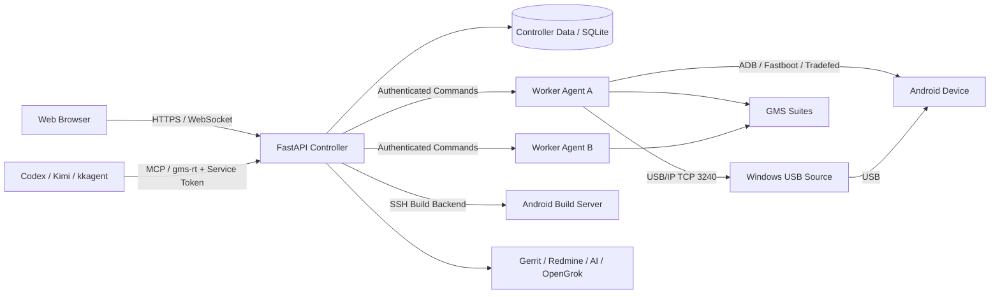

# GMS Remote Test Web

面向 Android GMS 认证测试场景的远程测试与设备调度平台：以 FastAPI Controller 为控制中心，通过 Worker Agent、USB/IP、ADB/Fastboot、noVNC、SSH 等能力，将分散在不同主机上的 Android 设备、GMS 测试套件、固件、构建服务器和测试结果统一到 Web 平台管理，并向 Codex / Kimi / kkagent 等 Agent 提供受控的 CLI/MCP 接入。

> 测试基础设施工具。生产部署前请阅读 [docs/deployment/production.md](docs/deployment/production.md) 与 [docs/security.md](docs/security.md)；不要将真实密码、Token、API Key 或其他凭据提交到 Git 仓库。

## 核心能力

- **GMS 测试**：CTS / GTS / VTS / STS 套件统一管理，单/多设备执行，Job 生命周期跟踪，报告与 Artifact 汇总
- **设备管理**：ADB / Fastboot / Recovery 状态识别，USB/IP 跨主机共享（Windows `usbipd-win` 来源），ADB Proxy，多 Worker 设备清单同步
- **集群与 Worker**：Controller + Worker Agent 架构，注册 / Heartbeat / Generation 管理，Device Claim / Lease，跨用户只读监控
- **固件与套件**：Firmware / GSI 烧录工作流（含 Windows Source Agent + RKDevTool 源端烧写），套件扫描 / 导入 / 分发
- **构建服务器**：SSH 接入，受控 Build Template，Tmux 后台构建与日志跟踪
- **Web 运维**：noVNC 远程桌面、Web Terminal、用户权限、Security Audit、Health / Metrics
- **工程辅助**：GMS Assistant、AI Provider 路由、Gerrit / Redmine / OpenGrok / APK 分析、知识库、Automation
- **Agent Runtime**：Codex / Kimi / kkagent 专用 MCP Plugin 与 `gms-rt` CLI，Service Token + 一次性 Enrollment / Approval Token

## 系统架构



四个角色：**Controller**（Web UI、认证、调度、配置、报告、集成）；**Worker Agent**（执行测试的 Linux 主机上的 ADB / Fastboot / Tradefed / USB/IP / 烧录）；**Device Source**（设备 USB 所在主机，直接 USB/IP 来源当前支持 Windows + `usbipd-win`）；**Agent Runtime**（Agent 主机上的 `gms-rt` CLI / MCP Adapter，不持有用户密码，不绕过权限与审批边界）。Worker 与 Agent 均通过带 Token 的 HTTPS API 访问 Controller。

架构决策与边界详见 [docs/architecture/](docs/architecture/overview.md)。

## 快速开始

```bash
git clone https://github.com/weixin1263831586/GMS_Remote_Test_Web.git
cd GMS_Remote_Test_Web
python3 -m venv .venv
source .venv/bin/activate
pip install -r requirements.txt
GMS_ENV=development python app.py   # 默认端口 5001
```

生产环境使用一键安装器（安装依赖、创建服务、配置 HTTPS 与备份）：

```bash
./install.sh
```

详见 [docs/deployment/quick-install.md](docs/deployment/quick-install.md) 与 [docs/deployment/production.md](docs/deployment/production.md)。

## Agent Quick Start

先在 Web 端生成一次性 Enrollment Code，然后在 Agent 主机（编译服务器）：

```bash
export GMS_INSTALL_CA_CERT=/path/to/controller-ca.crt
curl -fsSL --cacert "$GMS_INSTALL_CA_CERT" \
  https://CONTROLLER:5001/api/agent/install.sh | bash -s -- <ENROLLMENT_CODE>
gms-rt-system-selfcheck --json   # 验收：auth / health / devices / suites
```

Agent Package 自包含 `gms-rt` CLI、MCP Server、SDK、Skill 与各 Client Manifest，无需 clone 本仓库；Service Token 落盘为 `0600` 文件，Agent 不接触 Web 登录密码。

安装即配置：`gms-agent install` 会把 Controller URL / CA / token 路径写入
Agent profile（TOML，默认名 `<client>-<host>-<sha256(server)[:8]>`）并在
MCP 启动时自动注入环境，**无需手工 export `GMS_REMOTE_TEST_SERVER`**；
显式环境变量仅作为覆盖手段。同一台主机可安装多个 Controller（每个
Controller 一个 profile），enroll / update 支持用 `--profile` 消歧。

详见 [docs/agent/](docs/agent/overview.md)、[docs/agent/profiles.md](docs/agent/profiles.md) 与 [docs/cli/gms-rt.md](docs/cli/gms-rt.md)。

## 支持的设备接入路径

| 路径 | 适用场景 | 说明 |
|---|---|---|
| Local USB | Worker 本机直连设备 | 默认路径 |
| Windows USB/IP | 设备 USB 在 Windows 主机 | `usbipd-win`，支持自动 bind/attach |
| Linux USB/IP | 设备 USB 在 Linux 主机 | 完整固件烧写暂不支持（fail closed） |
| ADB Proxy | 多 Worker 间共享设备（adbproxy-rs） | 租约独立于传输协议 |

对比与选型详见 [docs/usbip/overview.md](docs/usbip/overview.md) 与 [docs/usbip/adb-proxy-vs-usbip.md](docs/usbip/adb-proxy-vs-usbip.md)。

## 固件烧写支持矩阵

| 环境 | 完整烧写 | 说明 |
|---|---|---|
| Local USB（Ubuntu 执行主机 / Worker） | ✅ | 在设备所属执行主机上经 SSH 使用 `upgrade_tool uf` 烧写 update.img / GSI（Controller / Worker / 执行主机可分离部署） |
| Windows USB/IP | ✅ | USB 所有权交还 Source 后由 Source Agent + RKDevTool 源端烧写，完成后重建 USB/IP |
| Linux USB/IP full | ❌ | 暂未支持，fail closed |

烧写流程、Loader → MaskROM 状态迁移、所有权状态机与故障恢复详见 [docs/usbip/firmware-flashing.md](docs/usbip/firmware-flashing.md)。

## 仓库结构

```text
bootstrap/     组合根：依赖装配、生产安全、运行环境装配
foundation/    共享基座：配置、进程、SSH 执行、响应、持久化
features/      业务域（FastAPI 路由 + service + repository + tests）
worker_agent/  Worker 侧执行与 Controller 通信
agent/         gms-remote-test Agent Package（唯一手改源）
plugins/       Agent 插件生成树（勿手改，用 tools/sync_agent_package.py 同步）
web/           浏览器 Shell 与静态前端
tests/         单元 / 契约 / 架构门禁 / E2E
tools/         同步、发布与文档生成脚本
docs/          架构 / 部署 / USB-IP / Agent / CLI 文档
```

## 文档

完整文档在 [docs/](docs/README.md)：

- [架构与 ADR](docs/architecture/overview.md)
- [部署](docs/deployment/quick-install.md)（安装 / 生产 / 配置 / Worker / 排障）
- [USB/IP 与固件烧写](docs/usbip/overview.md)
- [Agent Runtime](docs/agent/overview.md)
- [gms-rt 命令参考](docs/cli/command-reference.md)（由 `tools/generate_cli_docs.py` 生成）
- [安全模型](docs/security.md)
- [开发指南](docs/development.md)

## 开发

```bash
pip install -r requirements-dev.txt
PYTHONPATH=. python3 -m pytest features/<feature>/tests -q   # 目标 feature 测试
PYTHONPATH=. python3 -m pytest tests/architecture -q          # 架构门禁
python3 -m ruff check .
python tools/sync_agent_package.py                            # 修改 agent 源后同步生成树
python3 tools/generate_cli_docs.py                            # 新增 CLI 命令后刷新文档
```

约束与门禁详见 [docs/development.md](docs/development.md)：源码注释不得引用不存在的评审文档编号（架构决策写入 `docs/architecture/adr/`）；`plugins/` 生成树不手改；SSH / shell 执行边界与文件行数预算由 `tests/architecture/` 强制。

## 常见问题

高频问题与处理方式已按主题拆分：

- USB/IP attach 无设备 / 延迟高 / ADB 版本冲突 → [docs/usbip/troubleshooting.md](docs/usbip/troubleshooting.md)
- Worker 注册失败 / Token 权限 / 生产安全配置报错 → [docs/deployment/troubleshooting.md](docs/deployment/troubleshooting.md)
- noVNC 黑屏 / Build Server 连接 / 设备串口权限 → [docs/deployment/troubleshooting.md](docs/deployment/troubleshooting.md)
- Agent 安装后无法访问 Controller / Profile 歧义 → [docs/agent/troubleshooting.md](docs/agent/troubleshooting.md)

## 推荐部署拓扑

- **单机实验室**：Controller 与本地 Worker 同机，设备 USB 直连
- **多 Worker 测试实验室**：多台 Linux Worker 经 LAN/VPN 注册到 Controller，套件按 Worker 分发
- **Windows 远端 USB 设备**：Windows 主机运行 `usbipd-win` + OpenSSH，Worker 通过 USB/IP 与 Source Agent 使用设备
- **Agent / 编译服务器**：编译服务器安装 Agent Package，Codex / Kimi / kkagent 经 `gms-rt` / MCP 使用平台能力

## License

仅供内部测试基础设施使用。
