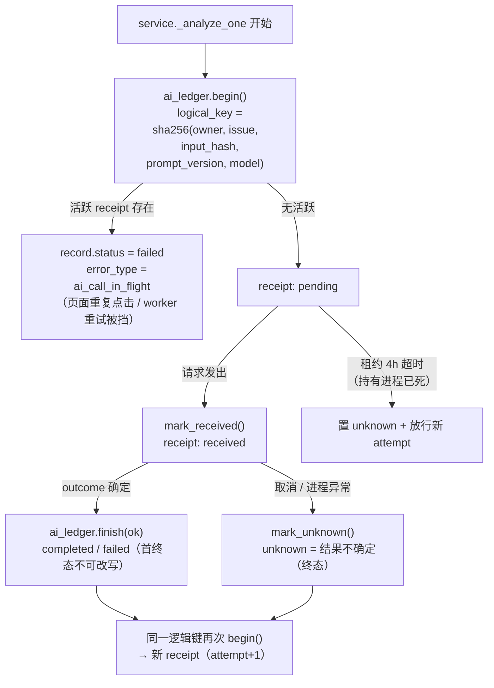
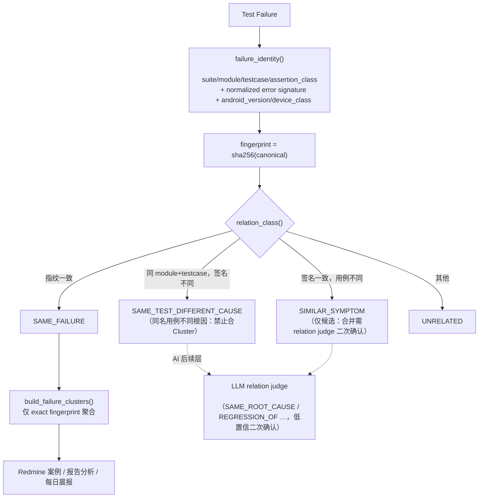
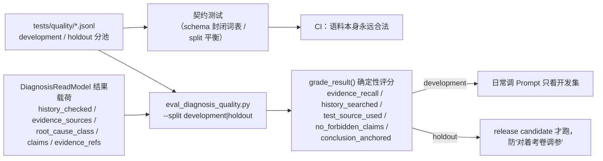
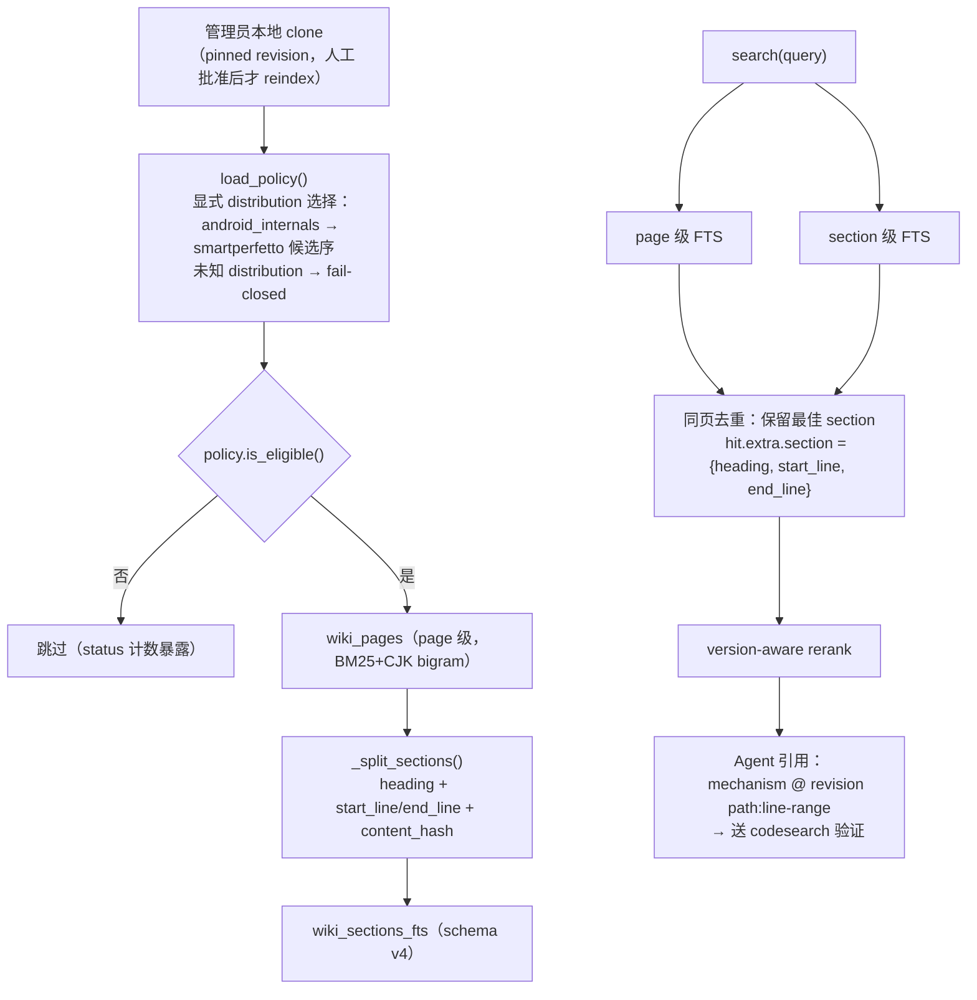
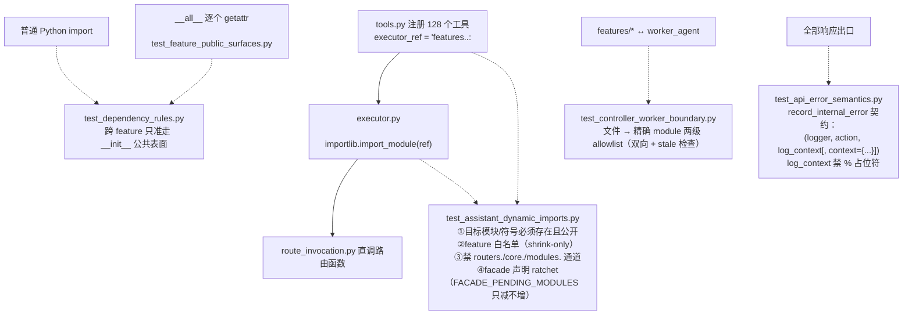
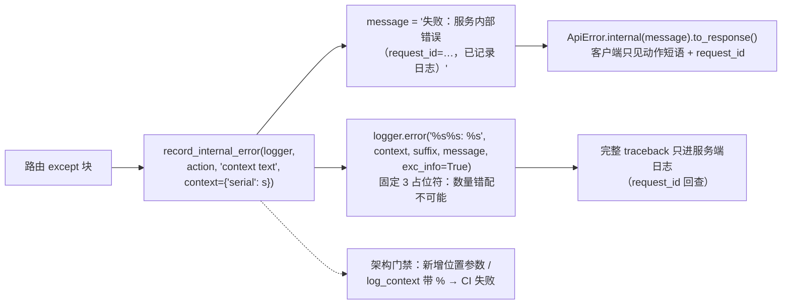
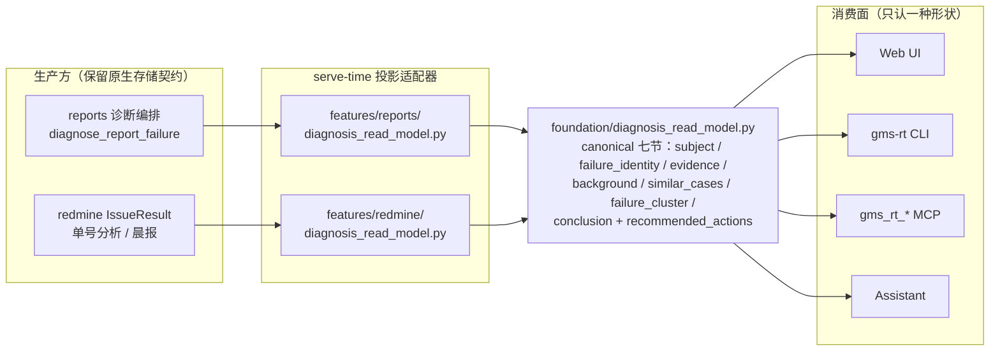

# AI 执行治理与诊断质量层

本页描述 GMS 平台的 AI 调用治理（execution receipts）与诊断质量工程
（golden corpus、failure identity、外部知识 chunk 检索），以及约束它们的
架构门禁。这些子系统回答全局代码审查指出的核心缺口：**AI / Agent /
知识快速成长，但缺少质量评测与 AI execution governance**。

设计原则（与 ADR-0013 / ADR-0014 一致）：

- **诊断质量不截断**：单次诊断不设 steps/token 预算，证据搜到哪跟到哪；
  治理发生在**操作层**（防重复调用、不确定态显式化、质量回归门禁）。
- **Wiki 永远是 background**：Android Internals 解释"Android 为什么这样
  工作"，不是 root-cause 证据（P4 级，见 ADR-0014 证据分级）。
- **确定性先于 AI**：指纹、关系分类、语料评分都是确定性函数；LLM judge
  只是后续增强层，不得越过确定性层直接合并/判定。

## 1. AI Execution Ledger（逻辑调用账本）

`features/redmine/ai_execution_ledger.py`。每次 AI 逻辑调用先登记
receipt，`logical_key = sha256(owner, issue, input_hash, prompt_version,
analyzer_version, model)`；同一逻辑键存在活跃 receipt 时拒绝重复发送。

要点：

- `unknown` 是**一等终态**，不是 failed 的别名——后续重试据此知道前一次
  outcome 未知，而不是误以为干净的失败。
- 终态不可改写：迟到的 completed 不得覆盖已记录的 failed/unknown。
- per-owner SQLite（与 daily brief 同库），建表走 `BEGIN IMMEDIATE`，
  Web/Worker/CLI 并发迁移安全。
- `record_ai_execution` 的 per-attempt 轨迹审计照旧保留；ledger 是其上的
  **逻辑调用层**，两者不互相替代。

## 2. Failure Identity / Cluster（失败身份层）

`features/redmine/failure_identity.py`。相似检索（`analysis_similarity`，
retrieval score）与关系判定明确分层：score 高 ≠ 同一失败。

要点：

- 归一化剥掉地址/十六进制/时间戳/计数——同一根因两次失败得到同一指纹，
  异常类型/调用点不同不会被归一掉。
- 同名 CTS 用例在设备 A/B/C 上完全可能各有根因；`SAME_TEST_DIFFERENT_
  CAUSE` 从确定性层就禁止合并。
- 指纹随 AI 执行轨迹落库（`record_ai_execution` 的 `failure_identity`
  字段），跨 attempt / 跨 issue 聚合无需重算。

## 3. Diagnosis Golden Corpus（诊断质量回归）

`tests/quality/`（语料 + 契约测试）与 `tools/scripts/testing/
eval_diagnosis_quality.py`（评测脚本）。把 Wiki Golden Query 的质量门禁
思想扩展到 AI 诊断：**测该找的证据有没有找到、有没有漏查历史案例、
有没有拿 Wiki 当根因、有没有胡编声明**，不比较生成 Markdown 长相。

要点：

- 根因类 / 禁止声明的**封闭词表**：语料不会漂移出无法统计的自由文本。
- `history_checked` 由运行时从工具轨迹注入，模型自报不算——防"编造查过
  历史"。

## 4. 外部知识 Section 级检索（schema v4）

`features/knowledge/external/android_internals.py`。消费方式从 page 级
升级为 Article → Section（heading chunk），对齐上游 Knowledge Pack 的
chunk 语义，但**继续本地 clone 自建索引，不打包再分发上游 pack**
（license 边界见 ADR-0014 第 5 节）。

要点：

- section 命中带**源文件行号锚点**（frontmatter 之后 body 的 1-based 行
  号），Binder/Zygote/LMKD 不再只返回上百 KB 文章的一个宽泛 snippet。
- 旧索引（user_version < 4）自动退化为 page 级检索，reindex 后启用
  section——不要求部署侧立即迁移。
- `policy_state_summary` 现记录 `policy_distribution` /
  `policy_projection_revision`："字典里的第一个"不再是内容信任边界；
  上游只声明未知消费方 distribution 时 fail-closed（不索引正文）。

## 5. Assistant 动态调用通道与门禁体系

Assistant 通过字符串引用平台能力（`executor_ref` /
`_fetch_router_json`），AST import 图看不见这条通道；专用门禁把它纳入
与普通 import 同等的边界约束。

## 6. 统一错误出口（record_internal_error 契约）

`foundation/error_model.py`。占位符错配（logging "not all arguments
converted"）与字面 `%s` 残留从机制上消除：

## 7. DiagnosisReadModel（统一诊断读模型）

全局审查第二十节的落地：Web / CLI（`gms-rt-*`）/ MCP（`gms_rt_*`）/
Assistant 此前各自消费不同的诊断负载形状（reports 的平铺编排 dict、
Redmine 的 `IssueResult` schema），同一段诊断结论在每个消费面重复适配。
现在由 `foundation/diagnosis_read_model.py` 定义唯一 canonical 形状，
生产方各提供一个 serve-time 投影适配器，消费面只认一种结构：

关键语义：

- **读时投影，不落库**：canonical 模型是 serve 时刻的派生物，挂在响应
  负载的 `read_model` 键；持久层仍保存生产方原生结果，Web 继续用原生
  字段渲染完整展示面（`suggested_reply_*` 等 Redmine 沟通字段不进
  canonical 模型）。
- **证据分层不因投影改变**（ADR 0014）：内部案例与源码锚点进
  `evidence`，外部 Android 机制知识永远进 `background`——顶层
  `evidence_level` 是联邦层的 background 盖章（证据层级），锚点核验
  三态聚合在 `anchor_status`（path_matched / path_missing / unknown），
  不带根因语义。
- **Failure Cluster 保守化**：读取时刻没有聚合上下文，`failure_cluster`
  只暴露本条确定性指纹与显式已知成员；检索召回（SIMILAR_SYMPTOM 级）
  不得计入 members——合并判定是 relation judge 的职责。
- **conclusion 封闭词表**：`status` ∈ confirmed/likely/possible/unknown，
  未知值 fail-closed 归为 unknown；reports 的规则兜底结论最高只能标
  `possible`，不得冒充 AI 结论。
- **防御性归一化**：生产方数据来自 AI 输出与多路召回，归一化对非
  dict / 缺键 / 超长文本降级处理，投影异常不得阻断诊断主流程。

跨 feature 依赖方向合规：reports 适配器派生失败指纹经
`features.redmine` 公共面取 `failure_identity`（不触碰内部模块），
`foundation/` 不 import 任何 feature。

## 门禁一览

| 门禁 | 文件 | 防什么 |
| --- | --- | --- |
| Controller/Worker 精确边界 | `tests/architecture/test_controller_worker_boundary.py` | 文件级 allowlist 被内部蔓延；allowlist 僵尸条目 |
| Assistant 动态依赖 | `tests/architecture/test_assistant_dynamic_imports.py` | 字符串通道绕过跨 feature gate；死通道复辟 |
| 公共表面可解析 | `tests/contract/test_feature_public_surfaces.py` | 声明为 public ≠ 真正可 import |
| 错误出口契约 | `tests/architecture/test_api_error_semantics.py` | 异常文本泄漏；record_internal_error 旧用法回潮 |
| 语料契约 | `tests/quality/test_diagnosis_corpus_contract.py` | 语料本身非法导致质量门禁静默失效 |
| Ledger 状态机 | `features/redmine/tests/test_ai_execution_ledger.py` | 防重复发送/终态改写/租约僵尸语义回归 |
| 失败身份 | `features/redmine/tests/test_failure_identity.py` | 同名用例误合并；归一化过度/不足 |
| 统一读模型 | `foundation/test_diagnosis_read_model.py` + 两个适配器测试 | canonical 章节漂移；封闭词表被绕过；投影破坏原生负载 |
| Wiki golden query | `features/knowledge/tests/test_external_provider.py::GoldenQueryCorpusTests` | 知识召回质量漂移 |

## 相关文档

- [ADR-0013 Daily Brief batch matches single-issue diagnosis](adr/0013-daily-brief-batch-matches-single-issue-diagnosis.md)
  （诊断不设预算的原则边界）
- [ADR-0014 External knowledge federation](adr/0014-external-knowledge-federation.md)
  （证据分级 P0–P5、license 边界）
- [Redmine Daily Brief](../redmine-daily-brief.md)（编排全景）
- [架构总览](overview.md)
