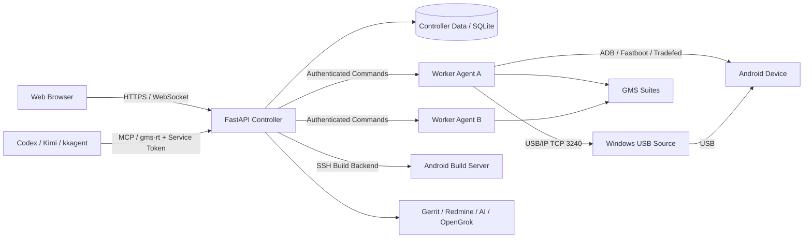

# 架构总览

GMS Remote Test Web 是面向 Android GMS 认证测试场景的远程测试与设备调度平台。它把分散在不同主机上的 Android 设备、GMS 测试套件、固件、构建服务器和测试结果统一到 Web 平台管理，覆盖 CTS / GTS / VTS / STS 测试工作流，以及设备共享、测试调度、固件烧录、报告分析、构建任务、自动化与外部系统集成。

## 总体拓扑



## 四个主要角色

1. **Controller**：FastAPI 应用（入口 `app.py`）。负责 Web UI、认证、权限、任务调度、配置、报告、集群状态和外部系统集成。
2. **Worker Agent**（`worker_agent/`）：运行在实际执行 GMS 测试的 Linux 主机上，负责 ADB、Fastboot、Tradefed、USB/IP Client、本地资源探测与任务执行。
3. **Device Source**：Android 设备物理 USB 所在主机。直接 USB/IP 来源工作流当前主要支持 Windows + `usbipd-win`（Ubuntu 来源支持设备共享、分配与重连）。
4. **Agent Runtime**（`agent/gms-remote-test/`）：运行在 Codex / Kimi / kkagent 所在主机，通过 `gms-rt` CLI 和 MCP Adapter 调用 Controller；不直接持有平台用户密码，也不绕过 Controller 的权限、审批和审计边界。

Worker 与 Controller 之间通过带 Token 的 HTTP(S) API 进行注册、Heartbeat、命令轮询和 ACK；Agent 使用独立的 Agent Service Token。生产环境要求 Worker 与 Agent 均通过受信任的 HTTPS Controller URL 访问平台。

## 数据与控制流

- **浏览器 → Controller**：HTTPS + Session Cookie（含 CSRF 防护），WebSocket 用于日志、进度与终端。
- **Agent → Controller**：`gms-rt` CLI / MCP，携带 Agent Service Token；破坏性操作需要一次性 Approval Token。
- **Controller ↔ Worker**：带 Worker Token 的 REST 注册 / Heartbeat / 命令轮询 / ACK，按 session 与 generation 管理重连。
- **Worker ↔ Device**：USB/IP 导入后按本地 USB 设备语义访问（adb server / fastboot / upgrade_tool / Tradefed）。
- **Controller ↔ 构建服务器**：SSH Backend + 受控 Build Template（见 [ADR-0004](adr/0004-ssh-execution-boundary.md)）。

## 代码组织

```text
Feature
  ↓
Foundation / Port
  ↓
Infrastructure
```

- `features/`：业务 Feature（auth、cluster、devices、firmware、build、test_execution 等），Feature 之间不互相 import 内部模块，共享逻辑下沉 `foundation/`（见 [ADR-0002](adr/0002-feature-foundation-boundary.md)）。
- `foundation/`：公共基础设施与跨 Feature Port（配置、响应、安全、SSH 执行器、进程边界等）。
- `agent/gms-remote-test/`：Agent Package 唯一手工维护源码树；`plugins/gms-remote-test/` 是生成结果。
- `worker_agent/`：Worker 侧执行与 Controller 通信。
- `web/`：浏览器 Shell 与静态前端。

## 相关决策记录

- [ADR-0001 Controller / Worker 边界](adr/0001-controller-worker-boundary.md)
- [ADR-0002 Feature / Foundation 边界](adr/0002-feature-foundation-boundary.md)
- [ADR-0003 Agent Profile Store](adr/0003-agent-profile-store.md)
- [ADR-0004 SSH 执行边界](adr/0004-ssh-execution-boundary.md)
- [ADR-0005 USB/IP 固件烧写所有权](adr/0005-usbip-firmware-ownership.md)
